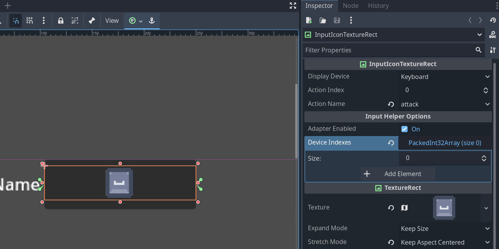

# Godot Input Icons

|  |  |
|-----------------------------------------|---------------------------------------|

This is a godot plugin that helps to display user registered actions and controller icons into a TextureRect control by introducing a new control InputIconTextureRect. This plugin also provides a way to get an action's icon at runtime

## Table of Contents

- [Features](#-features)
- [Requirements](#️-requirements)
- [Installation](#️-installation)
- [Documentation](#-documentation)
- [Contributing](#-contributing)
- [Changelog](#-changelog)
- [License](#-license)

## ✨ Features

- **InputIconTextureRect**: A new control node that displays icons registered with the input icons plugin.
  - Helps developers visualize their input icon textures for different input types in the editor as well as responds to changes in values at runtime
  - Select from list of registered user inputs
- **InputIconResolver**: A godot object that can be instantiated to resolve input icons at runtime
  - Supports modifier keys (shift, ctrl, etc)
- **Remap Input Demo**: A demo of how to use this plugin to remap inputs and display their icons in game
- **Godot Input Helper integration**: Integrate's with Nathan Hoad's godot input helper plugin to help simplify tedious controller tasks such as:
  - Swapping textures when controls are remapped for any device (keyboard, controller)
  - Swapping displayed textures from keyboard to controller and vice-versa
  - Completely optional!

> **Note**:  Remap input demo requires Input Helper Integration

## 🛠️ Requirements

- **Godot Engine**: Version 4.4.X or higher.

## 🖥️ Installation

1. Download the source of the repository and copy `addons/godot_input_icons` and place it `res://addons` folder in your godot project
2. Open your project and enable the plugin under `Project > Prject Settings > Plugins` and enable `Input Icons`

## 📝 How to use

The plugin is usable out of the box without doing anything but using the new control node.

1. Add the `InputIconTextureRect` to your scene
2. Click on it and open the inspector there will be 3 properties

   - Display Device: The device to use when choosing what input type to display in the texture
   - Action Index: The index of the registered user input action to use when choosing which icon to display in the texture
   - Action Name: A user registered action name (select from registered actions!)

### Registering your own icons

- The input icons plugin comes with default input maps that can be used but you can also create your own:

   1. Add a new `IconMapResource` anywhere in your project. Fill the resource out with your input icons
   2. Register your icon map resource with the plugin: `Project > Prject Settings > General > Input Helper > Settings > Input Icons Map`

> NOTE: Alternatively just change the default ones!

### Using Input Helper Integration

- Enable the input helper adapter in the project settings under `Project > Prject Settings > General > Input Helper > Settings > Use Input Helper`

- There are now extra properties added to the `InputIconTextureRect`
  - Adapter Enabled: When enabled the `InputIconTextureRect` will respond to input changes and controller remappings automatically using the input helper plugin
  - Device Indexes: The device indexes that the input map should (Set to empty array to listen to any device)

> NOTE: Default is [-1, 0] as that is keyboard and mouse + first controller input

## 📚 Documentation

For a detailed history of changes, see the [Changelog](CHANGELOG.md).

## 🤝 Contributing

Thanks for your interest in contributing. Please follow these guidelines to keep the project consistent and maintainable in the long-term.

See something you want or could improve upon? Make an issue or a PR! ✨

## Code Style & Recommendations

- Follow the official [godot style guide conventions](https://docs.godotengine.org/en/stable/tutorials/scripting/gdscript/gdscript_styleguide.html)

## 📋 Changelog

See the [CHANGELOG.md](CHANGELOG.md) file for a detailed list of changes in each version.

## 📜 License

This project is licensed under the **MIT License**. See the [LICENSE](LICENSE) file for details.
